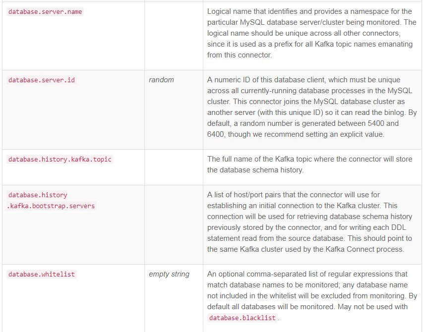

有时需要为flink提供流式数据

# Debezium

http://debezium.io/

# start kafka connector distributed

 bin/connect-distributed.sh -daemon config/connect-distributed.properties
 
 ```
 
bootstrap.servers=xx:9092,xxx:9092
group.id=connect-cluster
key.converter=org.apache.kafka.connect.json.JsonConverter
value.converter=org.apache.kafka.connect.json.JsonConverter
key.converter.schemas.enable=true
value.converter.schemas.enable=true
internal.key.converter=org.apache.kafka.connect.json.JsonConverter
internal.value.converter=org.apache.kafka.connect.json.JsonConverter
internal.key.converter.schemas.enable=false
internal.value.converter.schemas.enable=false
offset.storage.topic=connect-offsets
offset.storage.replication.factor=1
config.storage.topic=connect-configs
config.storage.replication.factor=1
status.storage.topic=connect-status
status.storage.replication.factor=1
offset.flush.interval.ms=10000
rest.port=8083
plugin.path=/home/hdfs/kafka-current/plugin

 ```

# create mysql user

GRANT SELECT, RELOAD, SHOW DATABASES, REPLICATION SLAVE, REPLICATION CLIENT ON *.* TO 'xx' IDENTIFIED BY 'xx';

# post mysql connector

create topic first

```
bin/kafka-topics.sh --create --topic `database.server.name` --replication-factor 2 --partitions 1 --zookeeper localhost:2183
bin/kafka-topics.sh --create --topic `database.history.kafka.topic` --replication-factor 2 --partitions 1 --zookeeper localhost:2183
```

```
curl -i -X POST -H "Accept:application/json" \
    -H  "Content-Type:application/json" http://xxxx:8083/connectors/ \
    -d '{
      "name": "yc-connector",
      "config": {
            "connector.class": "io.debezium.connector.mysql.MySqlConnector",
            "database.hostname": "xxxx",
            "database.port": "3306",
            "database.user": "xx",
            "database.password": "xx",
            "database.server.id": "2135664304",
            "database.server.name": "demo",
			"database.whitelist": "dxxx",
			"table.whitelist": "dxxx.txxx",
            "database.history.kafka.bootstrap.servers": "xxx:9092",
            "database.history.kafka.topic": "dbhistory.demo" ,
            "snapshot.mode": "schema_only_recovery ",
            "include.schema.changes": "true"
       }
    }'
```

```
curl -s "http://xxxx:8083/connectors" | jq '.[]' | \
xargs -I{connector_name} curl -s "http://xxxx:8083/connectors/"{connector_name}"/status" | \
jq -c -M '[.name,.connector.state,.tasks[].state]
```

comment: https://debezium.io/docs/connectors/mysql/

# delete connector

```
curl -X DELETE http://localhost:8083/connectors/[connector name]
```

# para detail



# bug

kafka 1.0.0 has bug 

https://issues.apache.org/jira/browse/KAFKA-6252