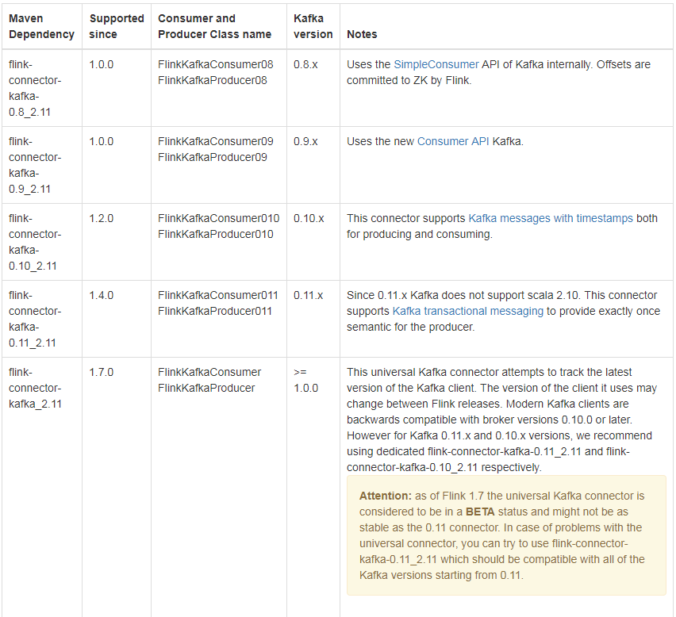
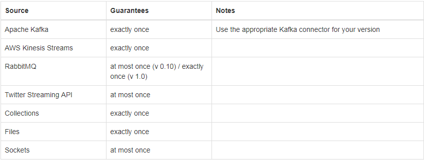
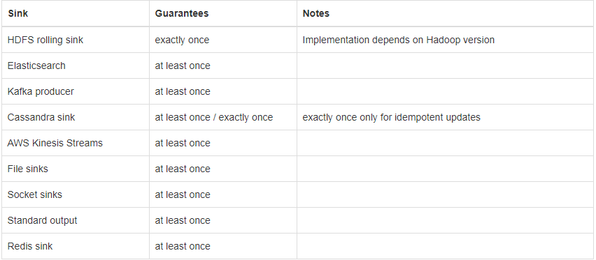

# flink kafka comsumer code analysis

# Flink Connector Overview

## Apache Kafka Connector



## Fault Tolerance Guarantees of Data Sources and Sinks

source



sink



# Code Analysis

以最新的API flink-sql-connector-kafka为主，以前的版本0.11、0.10、0.9大多数功能都差不多

1. flink comsumer解析
    关注Exactly Once、Fault Tolerance、Topic and Partition Discovery、Offset Committing
2. Kafka Connector metrics

## flink comsumer解析 

从这段代码来开始

```
//byte[] deserialize
val consumer = new FlinkKafkaConsumer[Array[Byte]](
  GROUP_ID,
  new AbstractDeserializationSchema[Array[Byte]]() {
    override def deserialize(message: Array[Byte]): Array[Byte] = message
  }, kafkaProps)

// create a Kafka source
val saicSource = env.addSource(consumer).name("saicSource").setParallelism(12)
```

## FlinkKafkaConsumer构造函数

从FlinkKafkaConsumer.java开始，FlinkKafkaConsumer提供了5个构造函数

```
public FlinkKafkaConsumer(String topic, DeserializationSchema<T> valueDeserializer, Properties props) {
	this(Collections.singletonList(topic), valueDeserializer, props);
}

public FlinkKafkaConsumer(String topic, KafkaDeserializationSchema<T> deserializer, Properties props) {
	this(Collections.singletonList(topic), deserializer, props);
}

public FlinkKafkaConsumer(List<String> topics, DeserializationSchema<T> deserializer, Properties props) {
	this(topics, new KafkaDeserializationSchemaWrapper<>(deserializer), props);
}

public FlinkKafkaConsumer(List<String> topics, KafkaDeserializationSchema<T> deserializer, Properties props) {
	this(topics, null, deserializer, props);
}

public FlinkKafkaConsumer(Pattern subscriptionPattern, DeserializationSchema<T> valueDeserializer, Properties props) {
	this(null, subscriptionPattern, new KafkaDeserializationSchemaWrapper<>(valueDeserializer), props);
}

public FlinkKafkaConsumer(Pattern subscriptionPattern, KafkaDeserializationSchema<T> deserializer, Properties props) {
	this(null, subscriptionPattern, deserializer, props);
```

这里简单解释一下三个参数topic、deserializer、Properties

***1. Topic：*** 

    支持单个topic场景
    支持多个topic场景，List<String>
    支持java正则匹配模式

***2. deserializer：***
    
    DeserializationSchema： describes how to turn the byte messages delivered by certain data sources (for example Apache Kafka) into data types (Java/Scala objects)
    KafkaDeserializationSchema：describes how to turn the Kafka ConsumerRecords into data types (Java/Scala objects)
    根据kafka中的数据类型继承其中的一个interface来解析出数据就行
    
***3. Properties：***

    kafka consumer消费的相关参数都可写到这个props里面去，在消费时都能加载，注意版本
    比如：
    val kafkaProps = new Properties
    kafkaProps.setProperty("zookeeper.connect", ZOOKEEPER_HOST)
    kafkaProps.setProperty("bootstrap.servers", KAFKA_BROKER)
    kafkaProps.setProperty("group.id", args(0))
    kafkaProps.setProperty("auto.offset.reset", "latest")

## FlinkKafkaConsumer初始化

FlinkKafkaConsumerBase提供了所有kafka版本的通用的方法，比如assignTimestampsAndWatermarks、setStartFromLatest、setStartFromEarliest....

接着会执行下面这个private函数

```
private FlinkKafkaConsumer(
	List<String> topics,
	Pattern subscriptionPattern,
	KafkaDeserializationSchema<T> deserializer,
	Properties props) {

	super(
		topics,
		subscriptionPattern,
		deserializer,
		getLong(
			checkNotNull(props, "props"),
			KEY_PARTITION_DISCOVERY_INTERVAL_MILLIS, PARTITION_DISCOVERY_DISABLED),
		!getBoolean(props, KEY_DISABLE_METRICS, false));

	this.properties = props;
	setDeserializer(this.properties);

	// configure the polling timeout
	try {
		if (properties.containsKey(KEY_POLL_TIMEOUT)) {
			this.pollTimeout = Long.parseLong(properties.getProperty(KEY_POLL_TIMEOUT));
		} else {
			this.pollTimeout = DEFAULT_POLL_TIMEOUT;
		}
	}
	catch (Exception e) {
		throw new IllegalArgumentException("Cannot parse poll timeout for '" + KEY_POLL_TIMEOUT + '\'', e);
	}
}
```

这里会将我们传进去的三个参数topic、序列化器、kafak consumer的参数传给父类super，即FlinkKafkaConsumerBase，
还会注册及将ByteArrayDeserializer加入到Kafka properties中并忽略我们自己配置的反序列化器，接着会尝试设置polling timeout，
即拉取的超时毫秒数，如果没有新的消息可供拉取，consumer会等待指定的毫秒数，到达超时时间后会直接返回一个空的结果集

执行FlinkKafkaConsumerBase父类的构造函数，接手前面传进来的参数，并初始化一些值，PARTITION_DISCOVERY、topicsDescriptor以及Metrics是否开启等

```
public FlinkKafkaConsumerBase(
		List<String> topics,
		Pattern topicPattern,
		KafkaDeserializationSchema<T> deserializer,
		long discoveryIntervalMillis,
		boolean useMetrics) {
	this.topicsDescriptor = new KafkaTopicsDescriptor(topics, topicPattern);
	this.deserializer = checkNotNull(deserializer, "valueDeserializer");

	checkArgument(
		discoveryIntervalMillis == PARTITION_DISCOVERY_DISABLED || discoveryIntervalMillis >= 0,
		"Cannot define a negative value for the topic / partition discovery interval.");
	this.discoveryIntervalMillis = discoveryIntervalMillis;

	this.useMetrics = useMetrics;
}
```

## 执行FlinkKafkaConsumerBase的open()方法

在执行open()方法之前会先执行initializeState()方法，后面再讲

这里继承了RichParallelSourceFunction->AbstractRichFunction->RichFunction

FlinkKafkaConsumer初始化会执行RichFunction的open()方法，具体实现在FlinkKafkaConsumerBase中。checkpoint的初始化后面再讲

* open()方法

```
public void open(Configuration configuration) throws Exception {
	// determine the offset commit mode
	this.offsetCommitMode = OffsetCommitModes.fromConfiguration(
			getIsAutoCommitEnabled(),
			enableCommitOnCheckpoints,
			((StreamingRuntimeContext) getRuntimeContext()).isCheckpointingEnabled());

	// create the partition discoverer
	this.partitionDiscoverer = createPartitionDiscoverer(
			topicsDescriptor,
			getRuntimeContext().getIndexOfThisSubtask(),
			getRuntimeContext().getNumberOfParallelSubtasks());
	this.partitionDiscoverer.open();

	subscribedPartitionsToStartOffsets = new HashMap<>();
	final List<KafkaTopicPartition> allPartitions = partitionDiscoverer.discoverPartitions();
```

这里首先会初始化offset commit mode，flink提供三种commit mode
    
    /** Completely disable offset committing. */
	DISABLED,

	/** Commit offsets back to Kafka only when checkpoints are completed. */
	ON_CHECKPOINTS,

	/** Commit offsets periodically back to Kafka, using the auto commit functionality of internal Kafka clients. */
	KAFKA_PERIODIC;

* 这里会执行下面函数来判断采取哪种方式的offset commit

```
public static OffsetCommitMode fromConfiguration(
		boolean enableAutoCommit,
		boolean enableCommitOnCheckpoint,
		boolean enableCheckpointing) {

	if (enableCheckpointing) {
		// if checkpointing is enabled, the mode depends only on whether committing on checkpoints is enabled
		return (enableCommitOnCheckpoint) ? OffsetCommitMode.ON_CHECKPOINTS : OffsetCommitMode.DISABLED;
	} else {
		// else, the mode depends only on whether auto committing is enabled in the provided Kafka properties
		return (enableAutoCommit) ? OffsetCommitMode.KAFKA_PERIODIC : OffsetCommitMode.DISABLED;
	}
}
```

* 如果 getRuntimeContext().isCheckpointingEnabled()为true 并且 enableCommitOnCheckpoints为true 那么设置为 ON_CHECKPOINTS，也就是当 flink 的检查点完成后提交 offset；
* 如果 isCheckpointingEnabled 为 false，而 enableAutoCommit(enable.auto.commit) 为 true，那么设置为 KAFKA_PERIODIC，也就是使用官方 KafkaConsumer 的周期性自动提交 offset 的机制；
* 否则设置为 DISABLED，也就是关闭 offset 提交。

接着createPartitionDiscoverer会获取子任务的并行度及并行度的index，这里同时会实例化KafkaPartitionDiscoverer，并初始化KafkaConsumer

接着调用partitionDiscoverer.discoverPartitions()获取所有topic的所有分区，放到一个叫allPartitions的List<KafkaTopicPartition>里面

接着会更具是否是从checkpoint还原来初始化每个partition的offset，checkpoint后面讲，先把open()和run()看完

* 当从checkpoint还原是执行如下代码

```
if (restoredState != null) {
	for (KafkaTopicPartition partition : allPartitions) {
		if (!restoredState.containsKey(partition)) {
			restoredState.put(partition, KafkaTopicPartitionStateSentinel.EARLIEST_OFFSET);
		}
	}

	for (Map.Entry<KafkaTopicPartition, Long> restoredStateEntry : restoredState.entrySet()) {
		if (!restoredFromOldState) {
			// seed the partition discoverer with the union state while filtering out
			// restored partitions that should not be subscribed by this subtask
			if (KafkaTopicPartitionAssigner.assign(
				restoredStateEntry.getKey(), getRuntimeContext().getNumberOfParallelSubtasks())
					== getRuntimeContext().getIndexOfThisSubtask()){
				subscribedPartitionsToStartOffsets.put(restoredStateEntry.getKey(), restoredStateEntry.getValue());
			}
		} else {
			// when restoring from older 1.1 / 1.2 state, the restored state would not be the union state;
			// in this case, just use the restored state as the subscribed partitions
			subscribedPartitionsToStartOffsets.put(restoredStateEntry.getKey(), restoredStateEntry.getValue());
		}
	}

	if (filterRestoredPartitionsWithCurrentTopicsDescriptor) {
		subscribedPartitionsToStartOffsets.entrySet().removeIf(entry -> {
			if (!topicsDescriptor.isMatchingTopic(entry.getKey().getTopic())) {
				LOG.warn(
					"{} is removed from subscribed partitions since it is no longer associated with topics descriptor of current execution.",
					entry.getKey());
				return true;
			}
			return false;
		});
	}

	LOG.info("Consumer subtask {} will start reading {} partitions with offsets in restored state: {}",
		getRuntimeContext().getIndexOfThisSubtask(), subscribedPartitionsToStartOffsets.size(), subscribedPartitionsToStartOffsets);
```
这里首先会判断topic的是否有增加分区，如果有则将新分区加入到allPartitions里面，并将此分区的offset设置为EARLIEST_OFFSET，即从初始开始读取

接着会循环restoredState.entrySet()这个state中取出<KafkaTopicPartition, Long>然后放到subscribedPartitionsToStartOffsets这个hashmap中，这里有个新旧state的判断

接下来默认会从state中过滤掉不属于topic中partition，当然也可以调用disableFilterRestoredPartitionsWithSubscribedTopics关闭过滤


* 当不是从checkpoint还原时也就新启动的程序或者删除跳过了checkpoint或者指定offset .etc情况执行如下代码

```
} else {
	// use the partition discoverer to fetch the initial seed partitions,
	// and set their initial offsets depending on the startup mode.
	// for SPECIFIC_OFFSETS and TIMESTAMP modes, we set the specific offsets now;
	// for other modes (EARLIEST, LATEST, and GROUP_OFFSETS), the offset is lazily determined
	// when the partition is actually read.
	switch (startupMode) {
		case SPECIFIC_OFFSETS:
			if (specificStartupOffsets == null) {
				throw new IllegalStateException(
					"Startup mode for the consumer set to " + StartupMode.SPECIFIC_OFFSETS +
						", but no specific offsets were specified.");
			}

			for (KafkaTopicPartition seedPartition : allPartitions) {
				Long specificOffset = specificStartupOffsets.get(seedPartition);
				if (specificOffset != null) {
					// since the specified offsets represent the next record to read, we subtract
					// it by one so that the initial state of the consumer will be correct
					subscribedPartitionsToStartOffsets.put(seedPartition, specificOffset - 1);
				} else {
					// default to group offset behaviour if the user-provided specific offsets
					// do not contain a value for this partition
					subscribedPartitionsToStartOffsets.put(seedPartition, KafkaTopicPartitionStateSentinel.GROUP_OFFSET);
				}
			}

			break;
		case TIMESTAMP:
			if (startupOffsetsTimestamp == null) {
				throw new IllegalStateException(
					"Startup mode for the consumer set to " + StartupMode.TIMESTAMP +
						", but no startup timestamp was specified.");
			}

			for (Map.Entry<KafkaTopicPartition, Long> partitionToOffset
					: fetchOffsetsWithTimestamp(allPartitions, startupOffsetsTimestamp).entrySet()) {
				subscribedPartitionsToStartOffsets.put(
					partitionToOffset.getKey(),
					(partitionToOffset.getValue() == null)
							// if an offset cannot be retrieved for a partition with the given timestamp,
							// we default to using the latest offset for the partition
							? KafkaTopicPartitionStateSentinel.LATEST_OFFSET
							// since the specified offsets represent the next record to read, we subtract
							// it by one so that the initial state of the consumer will be correct
							: partitionToOffset.getValue() - 1);
			}

			break;
		default:
			for (KafkaTopicPartition seedPartition : allPartitions) {
				subscribedPartitionsToStartOffsets.put(seedPartition, startupMode.getStateSentinel());
			}
	}

	if (!subscribedPartitionsToStartOffsets.isEmpty()) {
		switch (startupMode) {
			case EARLIEST:
				LOG.info("Consumer subtask {} will start reading the following {} partitions from the earliest offsets: {}",
					getRuntimeContext().getIndexOfThisSubtask(),
					subscribedPartitionsToStartOffsets.size(),
					subscribedPartitionsToStartOffsets.keySet());
				break;
			case LATEST:
				LOG.info("Consumer subtask {} will start reading the following {} partitions from the latest offsets: {}",
					getRuntimeContext().getIndexOfThisSubtask(),
					subscribedPartitionsToStartOffsets.size(),
					subscribedPartitionsToStartOffsets.keySet());
				break;
			case TIMESTAMP:
				LOG.info("Consumer subtask {} will start reading the following {} partitions from timestamp {}: {}",
					getRuntimeContext().getIndexOfThisSubtask(),
					subscribedPartitionsToStartOffsets.size(),
					startupOffsetsTimestamp,
					subscribedPartitionsToStartOffsets.keySet());
				break;
			case SPECIFIC_OFFSETS:
				LOG.info("Consumer subtask {} will start reading the following {} partitions from the specified startup offsets {}: {}",
					getRuntimeContext().getIndexOfThisSubtask(),
					subscribedPartitionsToStartOffsets.size(),
					specificStartupOffsets,
					subscribedPartitionsToStartOffsets.keySet());

				List<KafkaTopicPartition> partitionsDefaultedToGroupOffsets = new ArrayList<>(subscribedPartitionsToStartOffsets.size());
				for (Map.Entry<KafkaTopicPartition, Long> subscribedPartition : subscribedPartitionsToStartOffsets.entrySet()) {
					if (subscribedPartition.getValue() == KafkaTopicPartitionStateSentinel.GROUP_OFFSET) {
						partitionsDefaultedToGroupOffsets.add(subscribedPartition.getKey());
					}
				}

				if (partitionsDefaultedToGroupOffsets.size() > 0) {
					LOG.warn("Consumer subtask {} cannot find offsets for the following {} partitions in the specified startup offsets: {}" +
							"; their startup offsets will be defaulted to their committed group offsets in Kafka.",
						getRuntimeContext().getIndexOfThisSubtask(),
						partitionsDefaultedToGroupOffsets.size(),
						partitionsDefaultedToGroupOffsets);
				}
				break;
			case GROUP_OFFSETS:
				LOG.info("Consumer subtask {} will start reading the following {} partitions from the committed group offsets in Kafka: {}",
					getRuntimeContext().getIndexOfThisSubtask(),
					subscribedPartitionsToStartOffsets.size(),
					subscribedPartitionsToStartOffsets.keySet());
		}
	} else {
		LOG.info("Consumer subtask {} initially has no partitions to read from.",
			getRuntimeContext().getIndexOfThisSubtask());
	}
}
```

如果startupMode是SPECIFIC_OFFSETS 和 TIMESTAMP这两种模式，则会在这里初始化partition的offset，如果是其他模式(EARLIEST, LATEST, and GROUP_OFFSETS)，则会在实际读取分区时初始化

默认情况是StartupMode.GROUP_OFFSETS，当然可以调用setStartFromLatest()、setStartFromTimestamp(long startupOffsetsTimestamp)等方法更改

我们后面分析默认情况下初始化的时候是怎么分配分区的

## FlinkKafkaConsumer执行run()

SourceFunction 声明了两个接口方法：

    run：启动一个 source，输出 element 产生数据流
    cancel：取消 source，也就是将 run 方法的执行逻辑中止

flink 通过 SourceContext 提供 element 输出的接口：

    collect : 输出一个 element
    collectWithTimestamp : 根据用户提供的自定义的时间戳输出一个元素
    emitWatermark : 手动设置一个Watermark

接着FlinkKafkaConsumer开始执行逻辑的接口方法是 SourceFunction 的 run，实际实现在FlinkKafkaConsumerBase


```
public void run(SourceContext<T> sourceContext) throws Exception {
	if (subscribedPartitionsToStartOffsets == null) {
		throw new Exception("The partitions were not set for the consumer");
	}

	// initialize commit metrics and default offset callback method
	this.successfulCommits = this.getRuntimeContext().getMetricGroup().counter(COMMITS_SUCCEEDED_METRICS_COUNTER);
	this.failedCommits =  this.getRuntimeContext().getMetricGroup().counter(COMMITS_FAILED_METRICS_COUNTER);
	final int subtaskIndex = this.getRuntimeContext().getIndexOfThisSubtask();

	this.offsetCommitCallback = new KafkaCommitCallback() {
		@Override
		public void onSuccess() {
			successfulCommits.inc();
		}

		@Override
		public void onException(Throwable cause) {
			LOG.warn(String.format("Consumer subtask %d failed async Kafka commit.", subtaskIndex), cause);
			failedCommits.inc();
		}
	};

	// mark the subtask as temporarily idle if there are no initial seed partitions;
	// once this subtask discovers some partitions and starts collecting records, the subtask's
	// status will automatically be triggered back to be active.
	if (subscribedPartitionsToStartOffsets.isEmpty()) {
		sourceContext.markAsTemporarilyIdle();
	}

	LOG.info("Consumer subtask {} creating fetcher with offsets {}.",
		getRuntimeContext().getIndexOfThisSubtask(), subscribedPartitionsToStartOffsets);
	// from this point forward:
	//   - 'snapshotState' will draw offsets from the fetcher,
	//     instead of being built from `subscribedPartitionsToStartOffsets`
	//   - 'notifyCheckpointComplete' will start to do work (i.e. commit offsets to
	//     Kafka through the fetcher, if configured to do so)
	this.kafkaFetcher = createFetcher(
			sourceContext,
			subscribedPartitionsToStartOffsets,
			periodicWatermarkAssigner,
			punctuatedWatermarkAssigner,
			(StreamingRuntimeContext) getRuntimeContext(),
			offsetCommitMode,
			getRuntimeContext().getMetricGroup().addGroup(KAFKA_CONSUMER_METRICS_GROUP),
			useMetrics);

	if (!running) {
		return;
	}

	// depending on whether we were restored with the current state version (1.3),
	// remaining logic branches off into 2 paths:
	//  1) New state - partition discovery loop executed as separate thread, with this
	//                 thread running the main fetcher loop
	//  2) Old state - partition discovery is disabled and only the main fetcher loop is executed
	if (discoveryIntervalMillis == PARTITION_DISCOVERY_DISABLED) {
		kafkaFetcher.runFetchLoop();
	} else {
		runWithPartitionDiscovery();
	}
}
```

首先会判断相关值是否异常，初始化commit metrics指标，接着会初始化kafkaFetcher，kafkaFetcher初始化的同时也会初始化KafkaConsumerThread

则根据是否开启Partition Discovery来判断是直接执行runFetchLoop还是调用runWithPartitionDiscovery来执行，两者都会执行runFetchLoop

先来看第一种情况，直接执行kafkaFetcher.runFetchLoop(),这里会初始化执行KafkaFetcher中的runFetchLoop()

***kafkaFetcher.runFetchLoop方法***

```
@Override
public void runFetchLoop() throws Exception {
	try {
		final Handover handover = this.handover;

		// kick off the actual Kafka consumer
		consumerThread.start();

		while (running) {
			// this blocks until we get the next records
			// it automatically re-throws exceptions encountered in the consumer thread
			final ConsumerRecords<byte[], byte[]> records = handover.pollNext();

			// get the records for each topic partition
			for (KafkaTopicPartitionState<TopicPartition> partition : subscribedPartitionStates()) {

				List<ConsumerRecord<byte[], byte[]>> partitionRecords =
					records.records(partition.getKafkaPartitionHandle());

				for (ConsumerRecord<byte[], byte[]> record : partitionRecords) {
					final T value = deserializer.deserialize(record);

					if (deserializer.isEndOfStream(value)) {
						// end of stream signaled
						running = false;
						break;
					}

					// emit the actual record. this also updates offset state atomically
					// and deals with timestamps and watermark generation
					emitRecord(value, partition, record.offset(), record);
				}
			}
		}
	}
	finally {
		// this signals the consumer thread that no more work is to be done
		consumerThread.shutdown();
	}

	// on a clean exit, wait for the runner thread
	try {
		consumerThread.join();
	}
	catch (InterruptedException e) {
		// may be the result of a wake-up interruption after an exception.
		// we ignore this here and only restore the interruption state
		Thread.currentThread().interrupt();
	}
}
```

首先这里会初始化一个Handover，用于consumer thread和task thread之间传输数据或者异常，它有两个方法，一个是pollNext()，用于从kafka consumer消费到buffer的数据拉取数据

另一个是produce(final ConsumerRecords<byte[], byte[]> element)，用于将数据发送出去，在KafkaConsumerThread中调用

接着会调用consumerThread.start()启动KafkaConsumerThread线程，这个线程主要是从不断从kafka消费数据，然后发送出去，这里主要看亮点，分区分配和消费

***分区分配***

```
try {
	if (hasAssignedPartitions) {
		newPartitions = unassignedPartitionsQueue.pollBatch();
	}
	else {
		// if no assigned partitions block until we get at least one
		// instead of hot spinning this loop. We rely on a fact that
		// unassignedPartitionsQueue will be closed on a shutdown, so
		// we don't block indefinitely
		newPartitions = unassignedPartitionsQueue.getBatchBlocking();
	}
	if (newPartitions != null) {
		reassignPartitions(newPartitions);
	}
} catch (AbortedReassignmentException e) {
	continue;
}
```

这里会执行分区检测及分配，当前线程从哪些或者哪个分区消费数据，涉及到了很多kafka client接口的使用

hasAssignedPartitions默认为false，所以初始情况执行的是unassignedPartitionsQueue.getBatchBlocking()

会先将unassignedPartitionsQueue（其实就是前面open()里面初始化的subscribedPartitionsToStartOffsets）这个阻塞队列里面获取至少一个分区赋值给newPartitions

然后会调用reassignPartitions给comsumer分配partition及其offset值

具体分析见：[How_FlinkKafkaConsumer_Asign_Partition_When_Parallel_Execution](./How_FlinkKafkaConsumer_Asign_Partition_When_Parallel_Execution.md)

***comsumer消费数据***

```
if (records == null) {
	try {
		records = consumer.poll(pollTimeout);
	}
	catch (WakeupException we) {
		continue;
	}
}

try {
	handover.produce(records);
	records = null;
}
catch (Handover.WakeupException e) {
	// fall through the loop
}
```

这里调用kafka comsuemr的poll()函数拉取数据，kafka的默认每个批次拉取最大500条数据(max.poll.records)或者最大52428800bytes(fetch.max.bytes)

拉取到数据后通过Handover将数据发送出去，放到了一个类型为ConsumerRecords<byte[], byte[]>的next中，然后初始化records = null

这个KafkaConsumerThread一直在slot中循环执行，直到running为false

接着就开始执行下面这个循环

```
while (running) {
	// this blocks until we get the next records
	// it automatically re-throws exceptions encountered in the consumer thread
	final ConsumerRecords<byte[], byte[]> records = handover.pollNext();

	// get the records for each topic partition
	for (KafkaTopicPartitionState<TopicPartition> partition : subscribedPartitionStates()) {

		List<ConsumerRecord<byte[], byte[]>> partitionRecords =
			records.records(partition.getKafkaPartitionHandle());

		for (ConsumerRecord<byte[], byte[]> record : partitionRecords) {
			final T value = deserializer.deserialize(record);

			if (deserializer.isEndOfStream(value)) {
				// end of stream signaled
				running = false;
				break;
			}

			// emit the actual record. this also updates offset state atomically
			// and deals with timestamps and watermark generation
			emitRecord(value, partition, record.offset(), record);
		}
	}
}
```

这循环就从前面KafkaConsumerThread那个循环的Handover发送出来的数据从next中拉取出来，然后循环进行数据反序列化

然后调用emitRecord方法将解析出来的数据发送给flink task，这里反序列化器有个isEndOfStream方法，这个方法好像都返回false，不知道什么情况会返回true？

这里不仅发送数据，还会自动更新state中的offset值，并处处理时间戳及watermark的生成

***emitRecord方法***

```
protected void emitRecord(
	T record,
	KafkaTopicPartitionState<TopicPartition> partition,
	long offset,
	ConsumerRecord<?, ?> consumerRecord) throws Exception {

	emitRecordWithTimestamp(record, partition, offset, consumerRecord.timestamp());
}
```

***emitRecordWithTimestamp方法***

```
protected void emitRecordWithTimestamp(
		T record, KafkaTopicPartitionState<KPH> partitionState, long offset, long timestamp) throws Exception {

	if (record != null) {
		if (timestampWatermarkMode == NO_TIMESTAMPS_WATERMARKS) {
			// fast path logic, in case there are no watermarks generated in the fetcher

			// emit the record, using the checkpoint lock to guarantee
			// atomicity of record emission and offset state update
			synchronized (checkpointLock) {
				sourceContext.collectWithTimestamp(record, timestamp);
				partitionState.setOffset(offset);
			}
		} else if (timestampWatermarkMode == PERIODIC_WATERMARKS) {
			emitRecordWithTimestampAndPeriodicWatermark(record, partitionState, offset, timestamp);
		} else {
			emitRecordWithTimestampAndPunctuatedWatermark(record, partitionState, offset, timestamp);
		}
	} else {
		// if the record is null, simply just update the offset state for partition
		synchronized (checkpointLock) {
			partitionState.setOffset(offset);
		}
	}
}
```

这里会根据是否开启watermark及采用哪种watermark生成方式，flink中主要有两种，一种是周期性触发的Periodic Watermarks，另一种是基于事件触发的Punctuated Watermarks

watermark这一块如果有机会后面单独分析吧，这里最终都会通过sourceContext将一条一条的event通过collect方法输出出来


***runWithPartitionDiscovery***

下面来看看开启Partition Discovery的执行情况

```
private void runWithPartitionDiscovery() throws Exception {
	final AtomicReference<Exception> discoveryLoopErrorRef = new AtomicReference<>();
	createAndStartDiscoveryLoop(discoveryLoopErrorRef);

	kafkaFetcher.runFetchLoop();

	// make sure that the partition discoverer is waked up so that
	// the discoveryLoopThread exits
	partitionDiscoverer.wakeup();
	joinDiscoveryLoopThread();

	// rethrow any fetcher errors
	final Exception discoveryLoopError = discoveryLoopErrorRef.get();
	if (discoveryLoopError != null) {
		throw new RuntimeException(discoveryLoopError);
	}
}
```

这里就多一步创建Partition Discovery线程进行分区变更的动态发现将新分区加入到discoveredPartitions

```
private void createAndStartDiscoveryLoop(AtomicReference<Exception> discoveryLoopErrorRef) {
	discoveryLoopThread = new Thread(() -> {
		try {
			// --------------------- partition discovery loop ---------------------

			// throughout the loop, we always eagerly check if we are still running before
			// performing the next operation, so that we can escape the loop as soon as possible

			while (running) {
				if (LOG.isDebugEnabled()) {
					LOG.debug("Consumer subtask {} is trying to discover new partitions ...", getRuntimeContext().getIndexOfThisSubtask());
				}

				final List<KafkaTopicPartition> discoveredPartitions;
				try {
					discoveredPartitions = partitionDiscoverer.discoverPartitions();
				} catch (AbstractPartitionDiscoverer.WakeupException | AbstractPartitionDiscoverer.ClosedException e) {
					// the partition discoverer may have been closed or woken up before or during the discovery;
					// this would only happen if the consumer was canceled; simply escape the loop
					break;
				}

				// no need to add the discovered partitions if we were closed during the meantime
				if (running && !discoveredPartitions.isEmpty()) {
					kafkaFetcher.addDiscoveredPartitions(discoveredPartitions);
				}

				// do not waste any time sleeping if we're not running anymore
				if (running && discoveryIntervalMillis != 0) {
					try {
						Thread.sleep(discoveryIntervalMillis);
					} catch (InterruptedException iex) {
						// may be interrupted if the consumer was canceled midway; simply escape the loop
						break;
					}
				}
			}
		} catch (Exception e) {
			discoveryLoopErrorRef.set(e);
		} finally {
			// calling cancel will also let the fetcher loop escape
			// (if not running, cancel() was already called)
			if (running) {
				cancel();
			}
		}
	}, "Kafka Partition Discovery for " + getRuntimeContext().getTaskNameWithSubtasks());

	discoveryLoopThread.start();
}
```

分区加入到discoveredPartitions后，在KafkaConsumerThread中会自动将新分区分配给相应的comsumer进去消费

ok，整个消费流程就到此完成，数据都会通过sourceContext将一条一条的event通过collect方法输出出来

## FlinkKafkaConsumer的checkpoint状态存储

接下来看看state状态的相关代码，通过checkpoint将state保存到后端，确保了source的容错性

FlinkKafkaConsumerBase继承了CheckpointedFunction，有两个方法snapshotState()和initializeState()

***initializeState()方法***

initializeState()方法在distributed execution创建parallel function instance时会被调用，我们这里在初始化FlinkKafkaConsumerBase时会最先被执行

```
@Override
public final void initializeState(FunctionInitializationContext context) throws Exception {

	OperatorStateStore stateStore = context.getOperatorStateStore();

	ListState<Tuple2<KafkaTopicPartition, Long>> oldRoundRobinListState =
		stateStore.getSerializableListState(DefaultOperatorStateBackend.DEFAULT_OPERATOR_STATE_NAME);

	this.unionOffsetStates = stateStore.getUnionListState(new ListStateDescriptor<>(
			OFFSETS_STATE_NAME,
			TypeInformation.of(new TypeHint<Tuple2<KafkaTopicPartition, Long>>() {})));

	if (context.isRestored() && !restoredFromOldState) {
		restoredState = new TreeMap<>(new KafkaTopicPartition.Comparator());

		// migrate from 1.2 state, if there is any
		for (Tuple2<KafkaTopicPartition, Long> kafkaOffset : oldRoundRobinListState.get()) {
			restoredFromOldState = true;
			unionOffsetStates.add(kafkaOffset);
		}
		oldRoundRobinListState.clear();

		if (restoredFromOldState && discoveryIntervalMillis != PARTITION_DISCOVERY_DISABLED) {
			throw new IllegalArgumentException(
				"Topic / partition discovery cannot be enabled if the job is restored from a savepoint from Flink 1.2.x.");
		}

		// populate actual holder for restored state
		for (Tuple2<KafkaTopicPartition, Long> kafkaOffset : unionOffsetStates.get()) {
			restoredState.put(kafkaOffset.f0, kafkaOffset.f1);
		}

		LOG.info("Consumer subtask {} restored state: {}.", getRuntimeContext().getIndexOfThisSubtask(), restoredState);
	} else {
		LOG.info("Consumer subtask {} has no restore state.", getRuntimeContext().getIndexOfThisSubtask());
	}
}
```

context.getOperatorStateStore()：返回一个允许通过backend注册的opreate state的interface

这里通过ListState来保存我们的offset，类型为<Tuple2<KafkaTopicPartition, Long>>

我们目前的flink至少都是1.7了，都大于1.2，所以不会有老的state的情况，所有只需要看下面这段代码

```
this.unionOffsetStates = stateStore.getUnionListState(new ListStateDescriptor<>(
		OFFSETS_STATE_NAME,
		TypeInformation.of(new TypeHint<Tuple2<KafkaTopicPartition, Long>>() {})));

for (Tuple2<KafkaTopicPartition, Long> kafkaOffset : unionOffsetStates.get()) {
	restoredState.put(kafkaOffset.f0, kafkaOffset.f1);
}
```

getUnionListState会创建指定的state名称或者从checkpoint中读取恢复指定的state名称

如果有状态则取出来赋值给restoredState，如果没用，则打印log日志，后面会在open()判断restoredState是否为空

具体的state存储原理后面有机会再单独分析吧，下面看看snapshotState()方法

***snapshotState()***

```
@Override
public final void snapshotState(FunctionSnapshotContext context) throws Exception {
	if (!running) {
		LOG.debug("snapshotState() called on closed source");
	} else {
		unionOffsetStates.clear();

		final AbstractFetcher<?, ?> fetcher = this.kafkaFetcher;
		if (fetcher == null) {
			// the fetcher has not yet been initialized, which means we need to return the
			// originally restored offsets or the assigned partitions
			for (Map.Entry<KafkaTopicPartition, Long> subscribedPartition : subscribedPartitionsToStartOffsets.entrySet()) {
				unionOffsetStates.add(Tuple2.of(subscribedPartition.getKey(), subscribedPartition.getValue()));
			}

			if (offsetCommitMode == OffsetCommitMode.ON_CHECKPOINTS) {
				// the map cannot be asynchronously updated, because only one checkpoint call can happen
				// on this function at a time: either snapshotState() or notifyCheckpointComplete()
				pendingOffsetsToCommit.put(context.getCheckpointId(), restoredState);
			}
		} else {
			HashMap<KafkaTopicPartition, Long> currentOffsets = fetcher.snapshotCurrentState();

			if (offsetCommitMode == OffsetCommitMode.ON_CHECKPOINTS) {
				// the map cannot be asynchronously updated, because only one checkpoint call can happen
				// on this function at a time: either snapshotState() or notifyCheckpointComplete()
				pendingOffsetsToCommit.put(context.getCheckpointId(), currentOffsets);
			}

			for (Map.Entry<KafkaTopicPartition, Long> kafkaTopicPartitionLongEntry : currentOffsets.entrySet()) {
				unionOffsetStates.add(
						Tuple2.of(kafkaTopicPartitionLongEntry.getKey(), kafkaTopicPartitionLongEntry.getValue()));
			}
		}

		if (offsetCommitMode == OffsetCommitMode.ON_CHECKPOINTS) {
			// truncate the map of pending offsets to commit, to prevent infinite growth
			while (pendingOffsetsToCommit.size() > MAX_NUM_PENDING_CHECKPOINTS) {
				pendingOffsetsToCommit.remove(0);
			}
		}
	}
}
```

这个函数式通过jobmanager周期性的通知taskmanager触发checkpoint时调用，在StreamingFunctionUtils#snapshotFunctionState，至于过程后面单独分析checkpoint时再分析

首先会清空unionOffsetStates中的值，然后如果fetcher没用初始化，则返回从最初还原的offset或者分配的partition，同时会将restoredState放到pendingOffsetsToCommit中等待被commit

如果是运行过程中，则直接通过fetcher.snapshotCurrentState()获取topic partition的offset值，并放到pendingOffsetsToCommit

不过这个pendingOffsetsToCommit是在哪里有调用呢？后续进一步分析checkpoint这一块的时候再关注


# 总结

这里涉及到了很多知识，代码及其思想值得好好学

几个息息相关的方面需进一步分析：

* state的分配及触发流程
* watermark和时间戳的分配及传输


